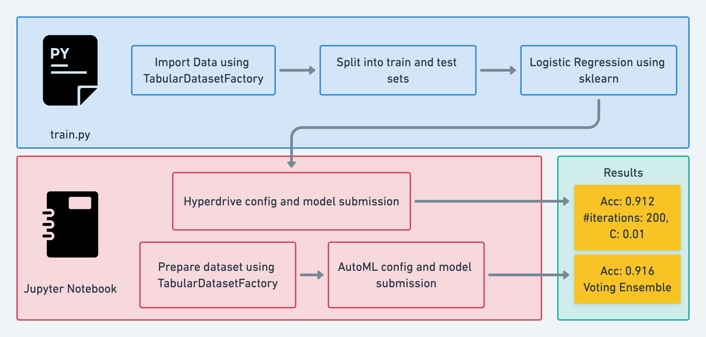

# Optimizing an ML Pipeline in Azure

## Overview
This project is part of the Udacity Azure ML Nanodegree. In this project, we build and optimize an Azure ML pipeline using the Python SDK and Scikit-learn's Logistic Regression model. First, I created a custom model and optimized its hyperparameters using HyperDrive. Next, we compared the model with the best hyperparameters to an Azure AutoML run.

## Summary
This dataset contains data about the marketing campaigns of a banking institution. Our goal is to predict whether the client will subscribe to the bank or not.

The best performing model was the AutoML model using the Voting Ensemble Algorithm with an accuracy of 0.916. The custom Logistic regression model had an accuracy of 0.912 with 200 iterations and C=0.01.

## Scikit-learn Pipeline
**Pipeline architecture**



**Parameter Sampler**

The hyperparameter sampler was defined in `udacity-project.ipynb` as below:

```python
ps = RandomParameterSampling(
    {
        '--C' : choice(0.001,0.01,0.1,1,10,100),
        '--max_iter': choice(50,100,200)
    }
)
```

Here, `C` is the regularization strength, and `max_iter` defines the total number of iterations. Some options available in the Azure sampling library are `RandomParameterSampling`, `GridParameterSampling`, `BayesianParameterSamping`, etc. Out of these, I used `RandomParameterSampling` as it is fast and supports early termination  for low-performance runs.

**Early Stopping Policy**

I used the BanditPolicy for early stopping, which is added to `udacity-project.ipynb` as follows:

```python
policy = BanditPolicy(evaluation_interval=2, slack_factor=0.1)
```

Here,`evaluation_interval` is an optional argument that represents the frequency for applying the policy. The `slack_factor` argument defines the amount of slack allowed with respect to the best performing training run.

## AutoML
**In 1-2 sentences, describe the model and hyperparameters generated by AutoML.**


## Pipeline comparison
**Compare the two models and their performance. What are the differences in accuracy? In architecture? If there was a difference, why do you think there was one?**

## Future work
**What are some areas of improvement for future experiments? Why might these improvements help the model?**

## Cluster clean up
**If you did not delete your compute cluster in the code, please complete this section. Otherwise, delete this section.**
**Image of cluster marked for deletion**